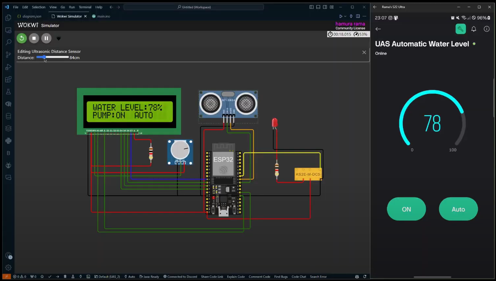

---

# Automatic Water Level Control System

This repository contains the code and instructions for creating an Automatic Water Level Control System using an ESP32, ultrasonic sensor, relay module, and Blynk for remote monitoring and control. The project is designed to maintain water levels within a specified range by automatically controlling a water pump based on the readings from the ultrasonic sensor. The system also features manual override capabilities.

## Features

- **Automatic Water Level Control**: Automatically turns the water pump on or off based on the water level.
- **Manual Override**: Allows manual control of the water pump via the Blynk app.
- **Real-Time Monitoring**: Displays water level and pump status on an LCD and Blynk app.
- **WiFi Connectivity**: Uses the ESP32's WiFi capabilities to connect to the Blynk cloud platform for remote monitoring and control.
- **EEPROM Storage**: Remembers the water level setpoint across resets.

## Components

- **ESP32**: The main microcontroller.
- **Ultrasonic Sensor**: Measures the water level.
- **Relay Module**: Controls the water pump.
- **LCD Display**: Shows water level percentage and pump status.
- **WiFi Module**: Integrated into the ESP32 for Blynk connectivity.
- **Blynk App**: Provides a user-friendly interface for monitoring and control.

## Setup and Configuration

1. **Hardware Connections**:
    - Ultrasonic Sensor:
        - Trigger pin to GPIO 5
        - Echo pin to GPIO 18
    - Relay Module:
        - Control pin to GPIO 19
    - LCD Display:
        - RS to GPIO 0
        - E to GPIO 4
        - D4 to GPIO 14
        - D5 to GPIO 27
        - D6 to GPIO 26
        - D7 to GPIO 25

2. **Blynk Setup**:
    - Download the Blynk app and create a new project.
    - Add widgets for water level (V0), pump state (V1), and mode (V2).
    - Get the Auth Token from the Blynk app and update the `BLYNK_AUTH_TOKEN` in the code.

3. **WiFi Configuration**:
    - Update the `ssid` and `pass` variables with your WiFi credentials.

4. **Code Upload**:
    - Open the code in your Arduino IDE.
    - Install necessary libraries: `EEPROM`, `LiquidCrystal`, `WiFi`, and `BlynkSimpleEsp32`.
    - Upload the code to your ESP32.

## How It Works

- The ultrasonic sensor measures the water level by sending a sound wave and calculating the distance based on the time it takes for the echo to return.
- The ESP32 reads the distance and calculates the water level percentage.
- If the system is in automatic mode, it will turn the pump on if the water level is below 80% and turn it off once it reaches or exceeds 80%.
- Users can switch between automatic and manual modes using the Blynk app.
- In manual mode, users can turn the pump on or off manually via the Blynk app.
- The LCD displays the current water level percentage, pump status, and mode (AUTO/MANUAL).
- The system updates the water level and pump status on the Blynk app in real-time.

## Blynk Widget Functions

- `V1` (Pump State): Receives pump state from the Blynk app (0 = OFF, 1 = ON).
- `V2` (Mode): Receives mode (0 = MANUAL, 1 = AUTO) from the Blynk app.

## Circuit Diagram



## Code

```cpp
#define BLYNK_TEMPLATE_ID "TMPL66ZYB08r0"
#define BLYNK_TEMPLATE_NAME "UAS Automatic Water Level"
#define BLYNK_AUTH_TOKEN "FPjRr9T3GpobEoYsrhcCaG4yHBM7cXyM"

#include <EEPROM.h>
#include <LiquidCrystal.h>
#include <WiFi.h>
#include <BlynkSimpleEsp32.h>

// Blynk Auth Token
char auth[] = BLYNK_AUTH_TOKEN;

char ssid[] = "Wokwi-GUEST"; 
char pass[] = ""; //password 

LiquidCrystal lcd(0, 4, 14, 27, 26, 25); // Update pins for ESP32

long duration, inches;
int set_val, percentage;
bool pump = false;
bool autoMode = true;

BlynkTimer timer;

void setup() {
  // Initialize Serial for debugging
  Serial.begin(115200);

  // Initialize LCD
  lcd.begin(16, 2);
  lcd.print("WATER LEVEL:");
  lcd.setCursor(0, 1); 
  lcd.print("PUMP:OFF MANUAL");

  // Initialize pins
  pinMode(5, OUTPUT); // Trigger pin for Ultrasonic sensor
  pinMode(18, INPUT); // Echo pin for Ultrasonic sensor
  pinMode(19, OUTPUT); // Relay control pin

  // Initialize EEPROM
  EEPROM.begin(512);
  set_val = EEPROM.read(0);
  if (set_val > 150) set_val = 150;

  // Initialize WiFi and Blynk
  Blynk.begin(auth, ssid, pass);

  // Set up a function to be called every second
  timer.setInterval(1000L, readSensor);
}

void loop() {
  Blynk.run(); // Run Blynk
  timer.run(); // Run BlynkTimer
}

void readSensor() {
  // Trigger the ultrasonic sensor
  digitalWrite(5, LOW);
  delayMicroseconds(2);
  digitalWrite(5, HIGH);
  delayMicroseconds(10);
  digitalWrite(5, LOW);
  duration = pulseIn(18, HIGH);
  inches = microsecondsToInches(duration);

  percentage = (set_val - inches) * 100 / set_val;

  // Update LCD display
  lcd.setCursor(12, 0);
  if (percentage < 0) percentage = 0;
  lcd.print(percentage);
  lcd.print("%   ");
  
  // Check if pump should be turned on/off based on water level and mode
  if (autoMode) {
    if (percentage < 80) {
      digitalWrite(19, HIGH); // Turn on pump
      pump = true; // Update pump state
    } else {
      digitalWrite(19, LOW); // Turn off pump
      pump = false; // Update pump state
    }
  } else {
    digitalWrite(19, pump);
  }
  
  // Update LCD display for pump state and mode
  lcd.setCursor(5, 1);
  if (pump) {
    lcd.print("ON ");
  } else {
    lcd.print("OFF");
  }

  lcd.setCursor(9, 1);
  if (autoMode) {
    lcd.print("AUTO  ");
  } else {
    lcd.print("MANUAL");
  }

  // Send data to Blynk
  Blynk.virtualWrite(V0, percentage); // Update percentage on Blynk
  Blynk.virtualWrite(V1, pump);       // Update pump state on Blynk
  Blynk.virtualWrite(V2, autoMode); // Update mode on Blynk
}

long microsecondsToInches(long microseconds) {
  return microseconds / 74 / 2;
}

// Blynk widget functions
BLYNK_WRITE(V1) {
  // Function to receive pump state from Blynk app
  pump = param.asInt();
}

BLYNK_WRITE(V2) {
  // Function to receive mode (auto/manual) from Blynk app
  autoMode = param.asInt();
}
```
